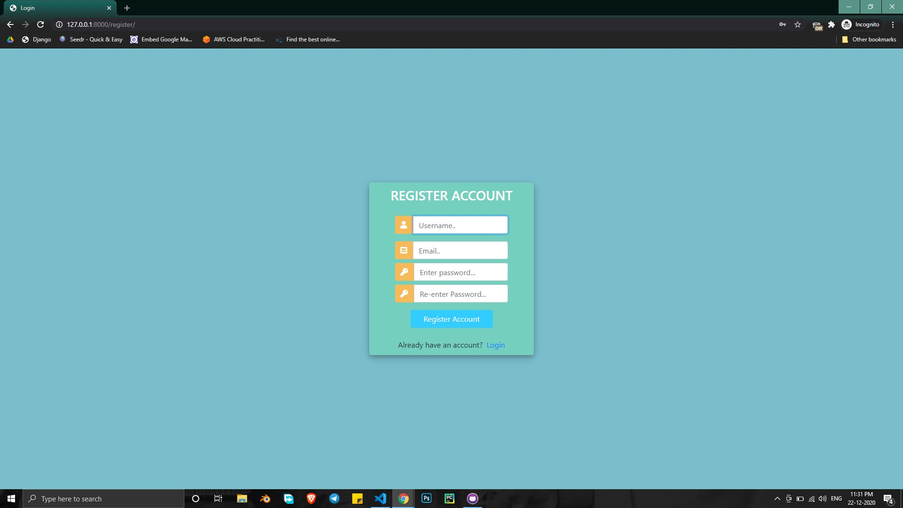
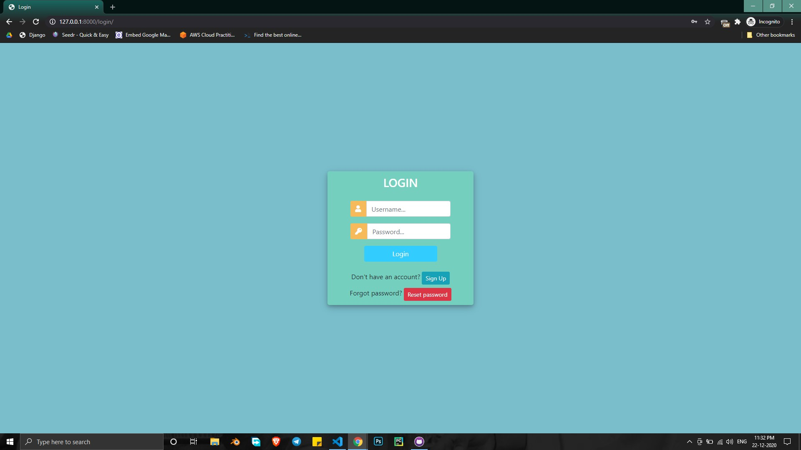
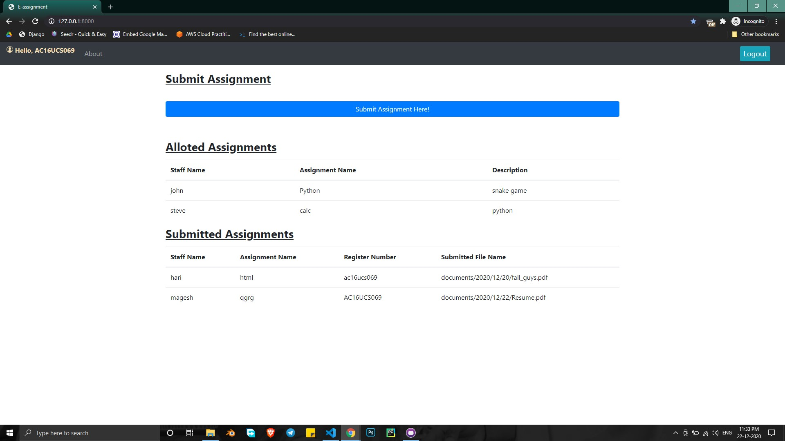
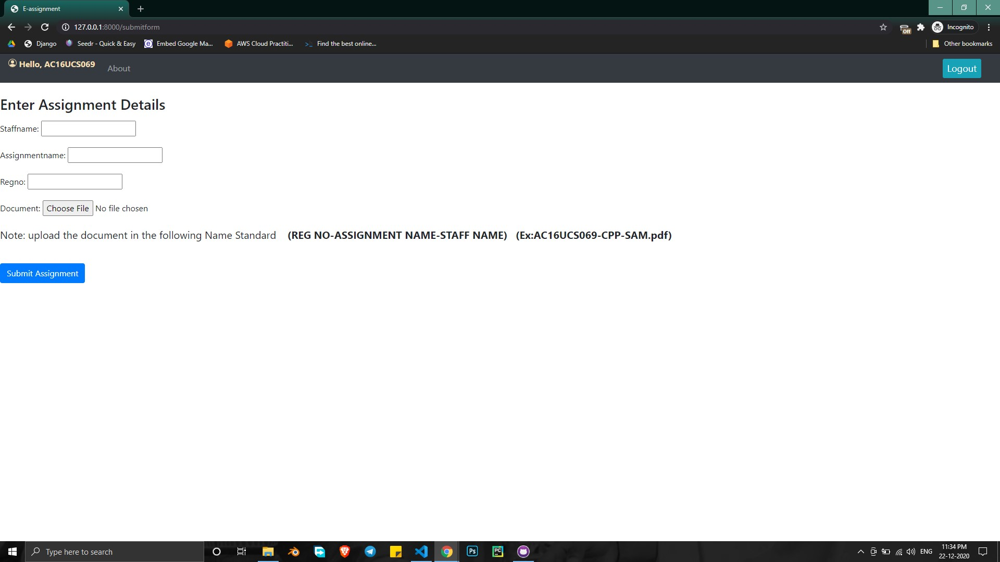
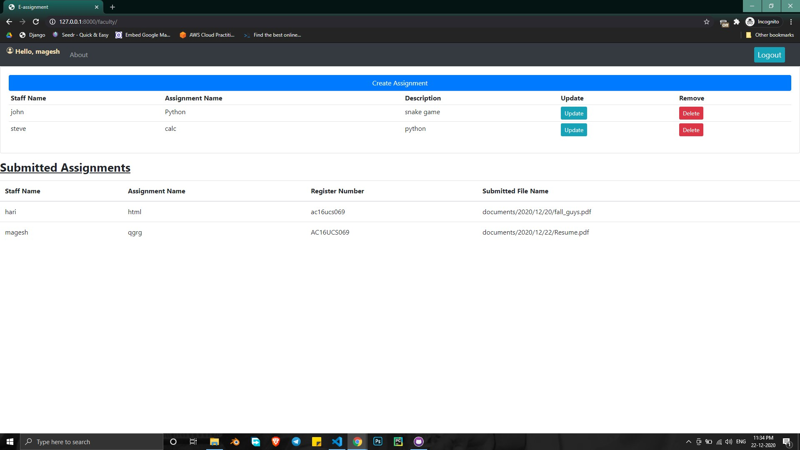
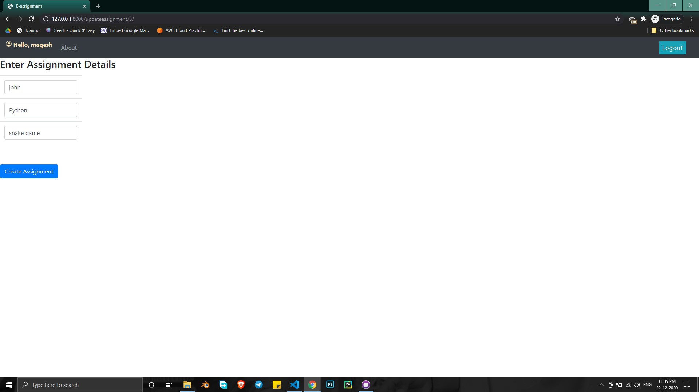
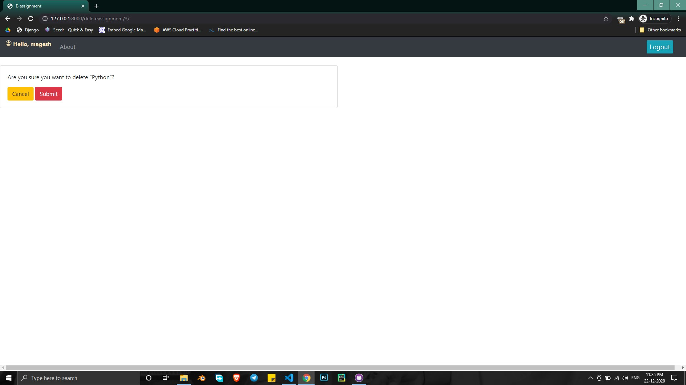

# E-Assignment

Online Assignment Application for Student and Faculty

## 1. Download Requirements using the following command:

```
pip install -r requirements.txt
```

## 2.Make Migrations using the following command:

```
python manage.py makemigrations


python manage.py migrate
```

## 3.Run the Application using the followind command:

```
python manage.py runserver
```

## Admin user can be created using the following command:

```
python manage.py createsuperuser

username

mailid

password

re-enter password

```

Once the Admin created we can view Admin page using the following url:
<b>127.0.0.1:8000/admin</b>

## About Application:

- <p>Register and login using the credentials.</p>
- <p>Faculty can create new assignments.</p>
- <p>Students can submit assignments using different page.</p>
- <p>Staff cannot submit student's assignments and Student cannot create assignments.</p>
- <p>You can Reset your password if you forget it</p>

### In order to reset the password follow the steps:

- Enter your mail id and password in settings.py (Not the secured way and Not recommended)

```
EMAIL_BACKEND = 'django.core.mail.backends.smtp.EmailBackend'
EMAIL_HOST = 'smtp.gmail.com'
EMAIL_PORT = 587
EMAIL_USE_TLS = True
EMAIL_HOST_USER = 'Enter your mail id'
EMAIL_HOST_PASSWORD = 'Enter your mail password'
```

- Allow low secure app in your gmail (Not secured way and Not recommended)

## Screenshots

### Signup Page



### Login Page



### Student Home Page



### Student ASsignment Submission Page



### Faculty Home Page



### Faculty Assignment Creation and Update Page



### Faculty Assignment Delete Page


